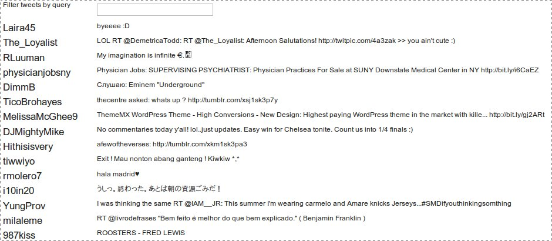

!SLIDE 
# Event driven

!SLIDE 
# Pub/Sub

!SLIDE 
# Callbacks 
## = you're doin' it wrong

!SLIDE bullets
# Backbone's MVCC
* Models
* Views
* Controllers
* (Collections)

!SLIDE bullets
# Collections
* Make REST calls
* Instantiates Models
* Fires events

!SLIDE
# Twitter Collection
    @@@ javascript
    Backbone.Collection.extend({
      model: Tweet,
      url: "http://api.twitter.com/1/
            statuses/public_timeline.json"
    });

!SLIDE bullets
# Collection Actions
* fetch
* add
* create
* remove
* get

!SLIDE bullets
# Collection Events
* refresh
* add
* remove
* change

!SLIDE bullets
# Model Actions
* get
* set
* save
* destroy

!SLIDE bullets
# Model Events
* add
* remove
* change

!SLIDE
# Models
## Can't do much unless part of a collection

!SLIDE
# Models
## Mostly helper methods

!SLIDE
# Views
## Gateway to the DOM

!SLIDE
# Tweet View
    @@@ javascript
    var TweetView = Backbone.View.extend({
      className: 'tweet',
      initialize: function() {
        _.bindAll(this, 'render');
      },
      render: function() {
        $(this.el).html(TweetTemplate({
          model: this.model
        }));
        return this;
      }
    });

!SLIDE
# No templates in Backbone
### In the previous example, TweetTemplate was an underscore template

!SLIDE
# View Events
### Receive information from the DOM

!SLIDE
# Filter View
    @@@ javascript

    FilterView = Backbone.View.extend({
      events: {
        'keyup input': 'filter'
      },
      filter: function() {
        // stuff!
      }
      // remainder of view code
      // initializer, render, etc
    }
    });

!SLIDE bullets
# View Events
* maintain scope
* automatically remove and bind

!SLIDE
# Controllers
### Super high level
### Routing and control flow

!SLIDE
# Message Controller
    @@@ javascript
    Backbone.Controller.extend({
      routes: {
        "": "index",
        "from/:sender": "from",
      },
      index: function() {
        MessageView.render();
      },
      from: function(sender) {
        FromView.filter(sender);
      }
    })

!SLIDE
# That's it!
### Backbone is only ~ 1k lines

!SLIDE
# So what's the fuss about?

!SLIDE
# Scalability

!SLIDE
### no, not webscale

!SLIDE
# Scalability of Code

!SLIDE
# Callbacks only go so far

!SLIDE
# Let's do a short example!

!SLIDE bullets
# Application
* Display twitter public feed
* Refresh every 60 seconds
* Find-as-you-type search
* (that persists after refreshes)

!SLIDE center
# Demo

!SLIDE
# 82 lines of js

!SLIDE
# Model
    @@@ javascript
    Tweet = Backbone.Model.extend({})

!SLIDE
# Collection
    @@@ javascript
    Backbone.Collection.extend({
      model: Tweet,
      url: "http://api.twitter.com/1/
            statuses/public_timeline.json"
    });

!SLIDE
# Tweet Template
    @@@ javascript
    TweetTemplate = _.template(
      "
" +
      "<%= model.get('user').screen_name %>"+
      "
"+
      "
"+
      "<%= model.escape('text') %>"+
      "
"
    );

!SLIDE
# Tweet View
    @@@ javascript
    TweetView = Backbone.View.extend({
      className: 'tweet span-24',
      initialize: function() {
        _.bindAll(this, 'render');
      },
      render: function() {
        $(this.el).html(TweetTemplate({
          model: this.model
        }));
        return this;
      }
    });

!SLIDE
# Tweet List View
    @@@ javascript
    TweetList = Backbone.View.extend({
      el: '#tweets',
      initialize: function() {
        _.bindAll(this, 'render');
      },
      // cont ...

!SLIDE
# Tweet List View
    @@@ javascript
      render: function() {
        $(this.el).html('');
        _.each(Feed.select(TweetFilter), function(tweet) {
          $(this.el).append(
            (new TweetView({model: tweet})).render().el
          );
        }, this);
      }
    });

!SLIDE
# So what's that TweetFilter?

!SLIDE
# Filter View
    @@@ javascript
    FilterView = Backbone.View.extend({
      el: '#filter',
      events: {
        'keyup input': 'filter'
      },
      initialize: function() {
        _.bindAll(this, 'filter', 'render');
      },
      // cont

!SLIDE
# Filter View
    @@@ javascript
      render: function() {
        $(this.el).html(
          "
Filter tweets by query
"+
          "
"+
            "<input type='text' />" +
          "
"
        );
        this.delegateEvents(this.events);
      },
      // cont

!SLIDE
# Filter View
    @@@ javascript
      // returns true if tweet text
      // contains field value
      filter: function() {
        TweetFilter = function(tweet) {
          val = this.$('input').val();
          text = tweet.escape('text');
          return text.indexOf(val) >= 0;
        };
        this.trigger('change:filter');
      }
    });

!SLIDE
# Glue it together
    @@@ javascript
    // Setup the filter view
    $(FilterView.render);

!SLIDE
# Glue it together
    @@@ javascript
    // Render tweet list when 
    // new tweets come in
    var Feed = new Tweets();
    Feed.bind(
      'refresh',
      TweetList.render
    );

!SLIDE
# Glue it together
    @@@ javascript
    // Render tweet list when
    // the filter changes
    FilterView.bind(
      'change:filter',
      TweetList.render
    );

!SLIDE
# Glue it together
    @@@ javascript
    // Refresh every 60 seconds
    var Refresh = function() {
      setTimeout(Refresh, 60000);
      Feed.fetch();
    };
    Refresh();
    
!SLIDE
# Scalability of Code

!SLIDE
# 71 lines of class definition

!SLIDE
# 9 lines of 'business logic'

!SLIDE
# Backbone inspires OO style

!SLIDE
# Logic pushed down to classes

!SLIDE
# Natural decoupling due to evented nature

!SLIDE
# Afterword
### hackability

!SLIDE
# Backbone is ~1k lines
### A lot of that is comments

!SLIDE
# To pull from twitter, I needed jsonp

!SLIDE
# Easily overrode backbone's sync method

!SLIDE
# Bonus!

!SLIDE
# Questions?
### [@ngauthier](http://twitter.com/ngauthier)
### [ngauthier@shortmail.com](mailto:ngauthier@shortmail.com)
### [http://ngauthier-backbone.heroku.com](http://ngauthier-backbone.heroku.com)
### [http://github.com/ngauthier/backbone-presentation](http://github.com/ngauthier/backbone-presentation)

